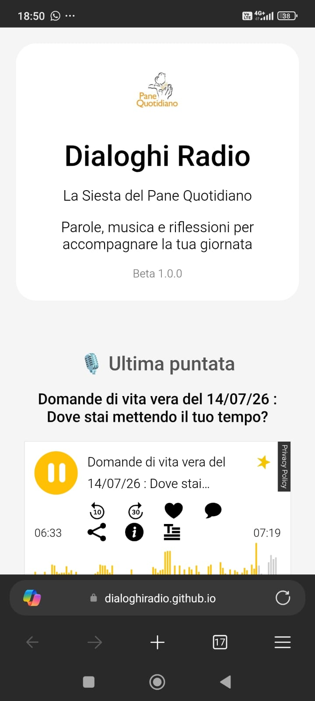
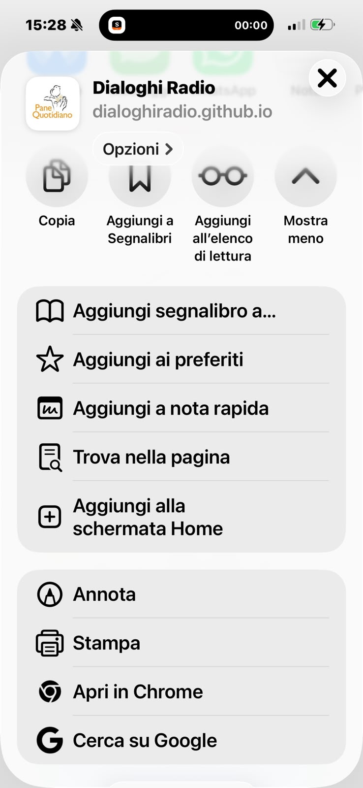

# Guida installazione - Dialoghi Radio

## Installare Dialoghi Radio sul telefono

## Cos'è Dialoghi Radio

Dialoghi Radio è una Web App (PWA) pensata per ascoltare:

- programmi radiofonici;
- riflessioni;
- percorsi biblici;
- contenuti audio.

Non è necessario scaricare l'app dal Play Store o dall'App Store.

È possibile aprire Dialoghi Radio dal browser e aggiungerla alla schermata principale dello smartphone come una vera applicazione.

---

# 📱 Installazione su Android

## Metodo consigliato: Google Chrome

### 1. Aprire il collegamento di Dialoghi Radio con Google Chrome

Aprire il sito ufficiale:

https://dialoghiradio.github.io/DR/

*(Il collegamento potrebbe cambiare in base alla versione pubblicata.)*

---

### 2. Aprire il menu di Chrome

Toccare i tre puntini ⋮ in alto a destra.

---

### 3. Installare l'app

Nel menu cercare una delle seguenti voci:

- **Installa**
- **Installa app**
- **Aggiungi alla schermata Home**
- **Crea scorciatoia**

La voce può cambiare in base al modello dello smartphone e alla versione di Android.

---

### 4. Icona nella schermata Home

Al termine dell'installazione comparirà l'icona:

🎧 Dialoghi Radio

nella schermata principale del telefono.

---

### 5. Apertura dell'app dalla Home

Toccando l'icona si apre Dialoghi Radio come un'applicazione.

---

## ⚠️ Se il collegamento viene aperto da WhatsApp

Alcuni telefoni aprono i collegamenti all'interno di WhatsApp.

In questo caso potrebbero non comparire le opzioni di installazione.

Procedere così:

1. Copiare il collegamento.
2. Aprire Google Chrome.
3. Incollare il collegamento nella barra degli indirizzi.
4. Ripetere la procedura di installazione.

---

# 🍎 Installazione su iPhone / iPad

L'installazione avviene tramite Safari.

### Procedura

1. Aprire Safari.
2. Visitare il sito ufficiale di Dialoghi Radio.
3. Toccare il pulsante:

**Condividi**  
(icona quadrato con freccia verso l'alto)

4. Selezionare:

**Aggiungi alla schermata Home**

5. Confermare con **Aggiungi**.

L'icona Dialoghi Radio apparirà nella schermata principale.

---

## Nota iPhone

Le schermate possono variare leggermente
in base alla versione di iOS.

---

# 🔗 Come condividere Dialoghi Radio

Per invitare qualcuno ad ascoltare Dialoghi Radio
è sufficiente condividere il collegamento ufficiale.

Esempio messaggio:

> 🎙️ Ti condivido Dialoghi Radio  
> Una radio di parole, musica e riflessioni  
> per accompagnare la giornata.  
>
> Apri il link e puoi aggiungerla alla schermata Home come un'app.

Collegamento:

https://dialoghiradio.github.io/DR/

---

# 📌 Nota importante

Dialoghi Radio non è disponibile sul Play Store
o sull'App Store.

Funziona tramite browser ed è installabile
come Web App.

---

# 🔄 Aggiornamenti dell'app

Dialoghi Radio viene aggiornata automaticamente
quando vengono pubblicate nuove modifiche.

Se non vengono visualizzati gli aggiornamenti:

## Computer

Premere:

**CTRL + F5**

per ricaricare completamente la pagina.

---

## Android

1. Chiudere Dialoghi Radio.
2. Chiudere Chrome dalle applicazioni recenti.
3. Riaprire l'app.

Se necessario:

- cancellare la cache di Chrome;
- reinstallare il collegamento dalla schermata Home.

---

## iPhone / iPad

Se l'app non si aggiorna:

1. Chiudere Safari.
2. Riaprire Dialoghi Radio.
3. Aggiornare la pagina.

In caso di problemi:

1. Eliminare l'icona dalla schermata Home.
2. Aprire nuovamente Safari.
3. Aggiungere di nuovo Dialoghi Radio.

---

❤️ Dialoghi Radio

Parole, musica e riflessioni per accompagnare la tua giornata.
